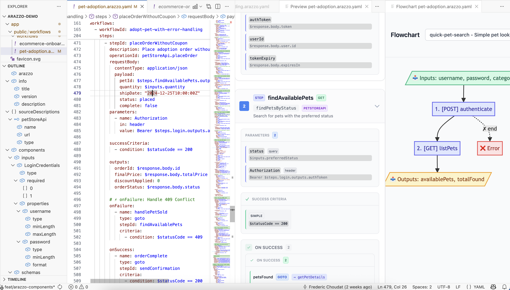

# Arazzo VSCode

**The VS Code editor for [Arazzo](https://spec.openapis.org/arazzo/latest.html) specifications** — live preview, flowchart diagrams, validation, and navigation for your multi-step API workflows.

## What is Arazzo?

[Arazzo](https://spec.openapis.org/arazzo/latest.html) is a specification by the **OpenAPI Initiative** for describing multi-step API workflows. It lets you orchestrate sequences of API calls with dependencies, conditions, and data passing between steps — all in a declarative YAML format.

This extension brings first-class Arazzo support to VS Code, so you can author, visualize, and validate your workflow specifications without leaving your editor.

## Quick Start

1. **Install** the extension from the [VS Code Marketplace](https://marketplace.visualstudio.com/items?itemName=connethics.arazzo-vscode)
2. **Open** any `.yaml` file containing an Arazzo specification
3. **Preview** — click the preview icon in the editor toolbar, or run `Open Arazzo Preview` from the Command Palette
4. **Flowchart** — click the graph icon, or run `Open Arazzo Flowchart` to visualize your workflow as a diagram

Both views update in real-time as you edit your YAML.

## Features

### Live Documentation Preview

Visualize your entire Arazzo specification as interactive documentation, side-by-side with your code.

- **Real-time updates** — the preview refreshes as you type
- **Multi-tab support** — view multiple specifications simultaneously
- **Theme-aware** — adapts to your VS Code theme (Light, Dark, High Contrast)
- **Interactive navigation** — Table of Contents, step-to-step links, and deep linking

### Flowchart View

See your workflows as visual diagrams powered by Mermaid.js.

- **Auto-sync** — automatically displays the workflow under your cursor
- **Click-to-navigate** — click a step in the flowchart to jump to it in both the editor and the documentation preview
- **Manual selection** — switch between workflows using the dropdown

### Validation

Real-time diagnostics as you type — catch errors before they reach your API pipeline.

- YAML syntax validation
- Arazzo-specific structural checks (missing fields, invalid references)
- Inline error/warning markers in the editor

### Outline Navigation

Navigate large specifications using the VS Code Outline view — workflows, steps, parameters, and components are all structured as symbols.

### Autocompletion

Context-aware YAML completion for Arazzo keywords and structure.

## Commands

| Command | Description |
|---------|-------------|
| `Open Arazzo Preview` | Open the interactive documentation panel |
| `Open Arazzo Flowchart` | Open the workflow diagram panel |

## Playground

Try Arazzo without installing anything — visualize your specifications in our **[online playground](https://arazzo.connethics.com/)**.

## Requirements

- VS Code 1.90.0 or newer

## Contributing

We welcome contributions! Please see [CONTRIBUTING.md](CONTRIBUTING.md) for details.

Source code: [github.com/connEthics/arazzo-vscode](https://github.com/connEthics/arazzo-vscode)

## License

MIT License — see the [LICENSE](LICENSE) file for details.

### Postcardware

If you find this extension useful, we'd love to hear from you! Send us a virtual postcard at **hello@connethics.com** — tell us who you are, where you're from, and how you use Arazzo. We collect every message and it truly makes our day.

## Release Notes

See the full [CHANGELOG](CHANGELOG.md) for details.

### 0.0.3

- Synchronized views: clicking a step in the Flowchart scrolls to it in the Documentation view
- Marketplace metadata for better discoverability

### 0.0.2

- Flowchart View with auto-sync and Mermaid.js rendering
- Interactive Preview Panel with live updates, multi-tab, and theme support

### 0.0.1

- Initial release with Outline, Autocompletion, and Validation support

